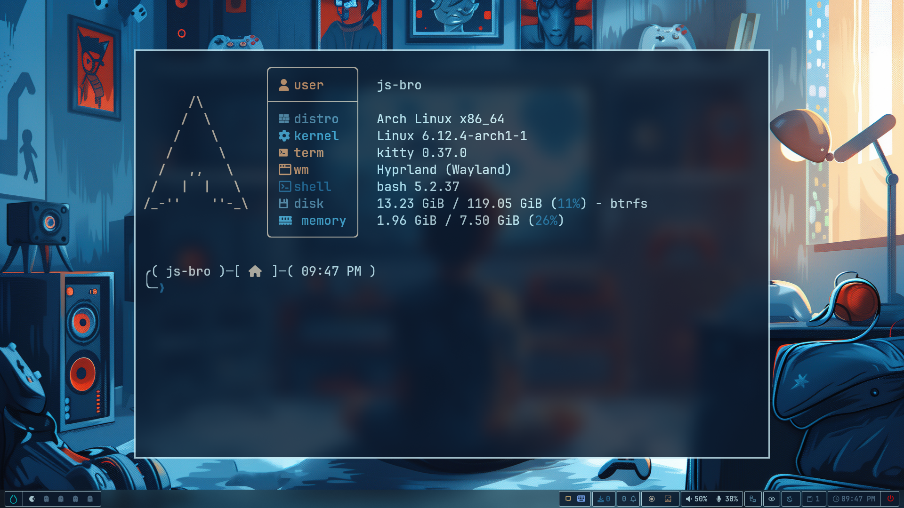
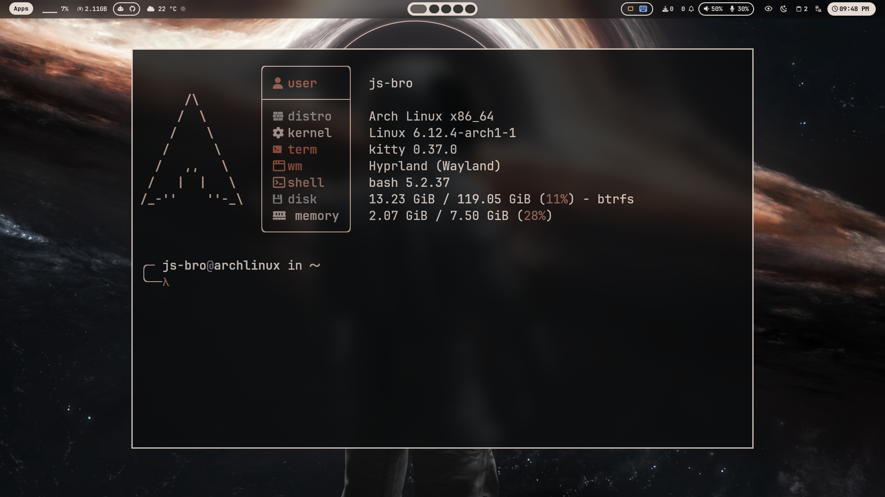
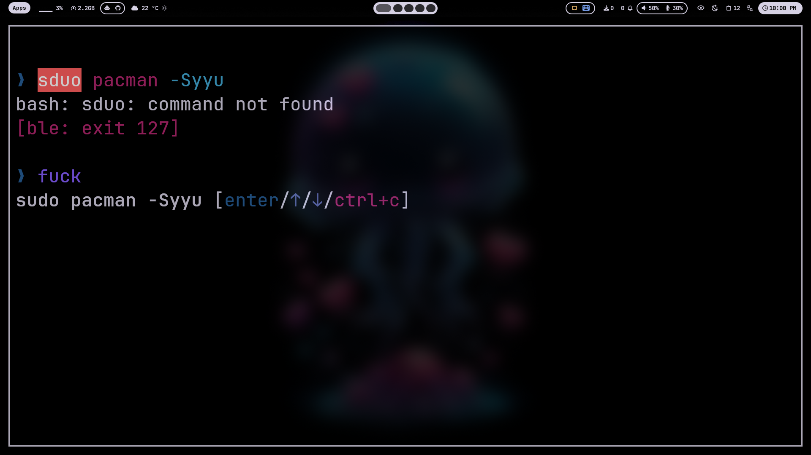
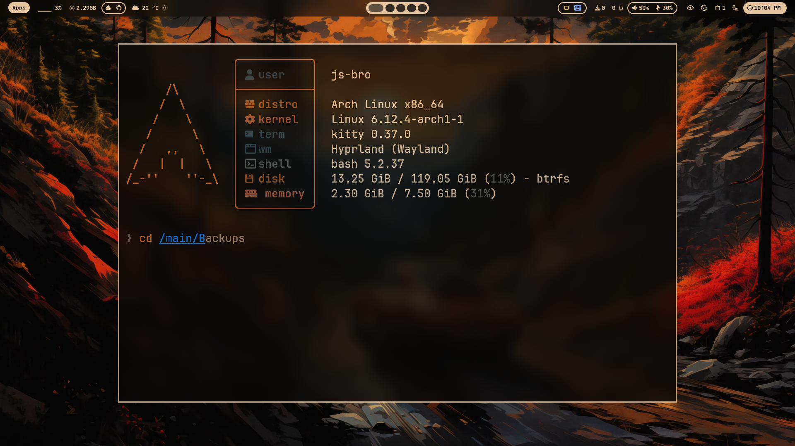

# 🛠️ Advanced Bash Customization Suite

A professional, feature-rich, and visually stunning terminal enhancement configuration for the native Bash shell. Crafted for developers who want the speed, stability, and compatibility of default Bash, combined with the premium experience, autocomplete speed, and aesthetics of modern shells like Zsh and Fish.

---

## 📺 Project Showcase

### Interactive Demo Video
For a quick walkthrough of the interface, layouts, and features, watch the demo video:

<video src="https://github.com/user-attachments/assets/908e74b8-b13c-447e-98a8-41cda7f2b2c5
" controls width="100%"></video>

<br>

### Gallery & Themes
Here is a preview of the prompt styles, file previews, and syntax capabilities:

<p align="center">
  
  
</p>
<p align="center">
  
  
</p>

---

## ✨ Features

### 🚀 1. Advanced Command Line Editing (via `ble.sh`)
- **Syntax Highlighting**: Real-time syntax validation (commands, arguments, paths, quotes) as you type.
- **Auto-Suggestions**: Fish-style inline auto-completions based on history and active directory.
- **Vi Mode Integration**: Fully configured Vim command-line editing mappings with sleek visual cursor states.

### 🔍 2. Fuzzy Finder & Quick Navigation (via `fzf` & `zoxide`)
- **Fuzzy Finder**: Search files, commands, and folders interactively (`Ctrl + T` and `Alt + C`) with rich directory layout trees.
- **Smart Directory Previews**: Displays file previews using `bat` and directory trees using `eza` directly inside the search menu.
- **Smart `cd`**: Memorizes visited directory weights and jumps to them instantly using history ranking.

### 📦 3. Distro-Agnostic Package Management
Single-word commands that automatically detect your active Linux distribution's package manager (`pacman`, `dnf`, `zypper`, `apt`):
- `cu`: Checks for pending official and community (AUR) updates.
- `update`: Updates the package repository indexes and upgrades the entire system.
- `install <pkg>`: Installs one or more packages without prompt interruptions.
- `remove <pkg>`: Cleanly uninstalls packages and purges orphan dependencies.

### 🌐 4. Git Workspace Enhancements
- **Git State Metrics**: The prompt dynamically displays the git branch and status:
  - `?`: Untracked files count
  - ``: Staged changes count
  - `!`: Uncommitted changes count
  - `✓`: Working tree clean indicator
- **Smart Git Push (`push`)**: An interactive command that parses repository state, requests a commit message, validates the push status, and signals completion with an audio notification chime (`sound.mp3`).

### 🎨 5. Menu-Driven UI Customizations
- **Native Prompt Selector (`prompt`)**: Toggle between 8 curated 1-line and 2-line prompt styles (Classic Minimal, Sleek Neon, Crystal Block, and two-line brackets).
- **Starship Integration (`style`)**: Fast prompt engines using predefined configurations.
- **Fastfetch Utility (`ffstyle` / `ffimg`)**: Easily configure fastfetch greetings and visual presets.

### 💻 6. Scaffolding & Compile Helpers
- **C++ Compiler Helper (`fn_compile_cpp`)**: Compiles `.cpp` files with C++20 standard flags and optional immediate execution (`-o`).
- **React-Vite Bootstrapper (`vite`)**: Bootstraps React-Vite projects (NPM, PNPM, Yarn, Bun) with automated VS Code auto-run tasks.

---

## 📥 Installation

### Prerequisites
- **Nerd Fonts**: An installed Nerd Font (such as **JetBrains Mono Nerd Font**) configured in your terminal settings to display prompt glyphs correctly.
- **Curl**: Ensure `curl` is installed on your system.

### Option A: Direct Installation (Recommended)
Run the automated installation script directly from the remote repository:

```bash
bash <(curl -sS https://raw.githubusercontent.com/Maheswara660/Bash/main/direct_install.sh)
```

### Option B: Manual Installation
Clone the repository, make the installer executable, and run it locally:

```bash
git clone --depth=1 https://github.com/Maheswara660/Bash.git
cd Bash
chmod +x install.sh
./install.sh
```

---

## ⚙️ Configuration & Architecture

All customized modules are cleanly modularized inside the `~/.bash` directory:

| Path | Description |
| ---- | ----------- |
| [`.bashrc`](file://~/.bash/.bashrc) | Master configuration file. Slices completions, hooks aliases, and mounts layout configurations. |
| [`alias.sh`](file://~/.bash/alias.sh) | Defines keyboard shortcuts for navigation, editors, system operations, and Git. |
| [`functions.sh`](file://~/.bash/functions.sh) | Slices interactive developer tools, timers, sound indicators, compiler commands, and boots. |
| [`change_prompt.sh`](file://~/.bash/change_prompt.sh) | Shell prompt switcher tool that updates prompt settings immediately. |
| [`change_style.sh`](file://~/.bash/change_style.sh) | Starship preset engine selector tool. |
| [`sound.mp3`](file://~/.bash/sound.mp3) | Notification audio chime played upon successful git actions. |
| [`starship/`](file://~/.bash/starship) | Directory containing custom Starship configuration presets. |

---

## 🛠️ Main Command Shortcuts

| Category | Shortcut | Target Action |
| -------- | -------- | ------------- |
| **Navigation** | `..` | Go up one directory level |
| | `...` | Go up two directory levels |
| | `.` | Jump directly to root directory (`/`) |
| **System Listing** | `ls` | Flat folder layout list |
| | `la` | Extended view list |
| | `ll` | Details summary list |
| | `tree` | Tree format structure view |
| **Utilities** | `cat` | Highlighting cat view (via `bat`) |
| | `find` | Fuzzy file search inside Vim editor |
| | `sys` | Interactive process manager (via `btop`) |
| | `play` | Test sound output (`sound.mp3`) |
| **Git Shortcuts** | `add` | Git staging command (`git add .`) |
| | `commit` | Fast commit (`git commit -m`) |
| | `push` | Custom safe commit/push CLI workflow |
| | `info` | Detailed git status breakdown |

---

## 📄 License
This project is licensed under the GNU General Public License v3 - see the [LICENSE](LICENSE) file for details.
